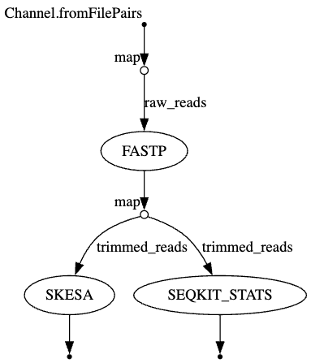

# bacterial_genomics_nextflow_pipeline

A modular Nextflow pipeline for bacterial genome QC and assembly, developed as part of Georgia Tech's BIOL7210 Computational Genomics course.

This repository contains a **Nextflow pipeline** for performing **quality control**, and assembling genomic sequences.

**Course**: BIOL7210 - Computational Genomics  
**Author**: S Birendra Kumar  
**Institution**: Georgia Tech  
**GitHub Repo**: `https://github.com/Birendra-Kumar-S/bacterial_genomics_nextflow`  
**Nextflow Version**: `24.10.4.5934`  
**Package manager**: `conda`

## **Workflow Overview**
This workflow **performs quality control, calculates trimmed read statistics and assembles genomic sequences.**  
The pipeline supports **both sequential and parallel processing** to optimize execution.

### ** Workflow Execution Order**
1️⃣ **Sequential Execution**:
- **FASTP** → `SKESA` (Genome Assembly)

2️⃣ **Parallel Execution**:
- **FASTP** → `SEQKIT` (Read Statistics)

### Key Features

- **Read Processing**
  - Quality control and adapter trimming with **FASTP (v0.24.0)**
  
- **Assembly**
  - De novo genome assembly with **SKESA (v2.5.1)**
  
- **READ statistics**
  - Calculation of quality filtered or trimmed reads' statistics using **SeqKit (v2.10.0)**

## Requirements

- [Nextflow](https://www.nextflow.io/) **(v24.10.0 or later)**
- [conda](https://github.com/conda/conda) **(v25.3.0 or later)**

### Tested Environment

```bash
System Version: macOS 15.3.2 (24D81)
OS       : Sequoia 15.3.2
Model Name: MacBook Pro
Kernel   : Darwin 24.3.0
Chip     : Apple M4
Number of Cores: 10 (4 performance and 6 efficiency)
RAM      : 16 GB
Nextflow : v24.10.5
Java     : OpenJDK 22 (via Conda)
```

## DAG Workflow Diagram 
Diagram illustrating the pipeline's workflow, showing the sequence of processes and their dependencies. Obtained using Nextflow's built-in DAG visualization tool.

<div align="center">
  
</div>


### Test Data 

The included test data in the `test_data/` directory contains paired-end reads from *Listeria monocytogenes* **(SRA accession: SRR1556289 & SRR1556296)**


## Tools Used

- [Nextflow](https://www.nextflow.io/) - Workflow engine (DSL2)
- [FASTP](https://github.com/OpenGene/fastp) - Read quality control
- [SKESA](https://github.com/ncbi/SKESA) - De novo assembly
- [SeqKit](https://github.com/shenwei356/seqkit) - Read Statistics


## Quick Start

**Perform the below steps sequentially**

### Setup

```bash
# Clone the repository
git clone https://github.com/Birendra-Kumar-S/bacterial_genomics_nextflow_pipeline
cd bacterial_genomics_nextflow_pipeline
```

### Conda env installation

**Would suggest to create a new conda env with nextflow installed as specified below:**

```bash
CONDA_SUBDIR=osx-64 conda create -n nf_test -c bioconda nextflow -y

conda activate nf_test
```

### Pipeline execution

```bash
export CONDA_SUBDIR=osx-64
nextflow run pipeline.nf -with-conda
```

